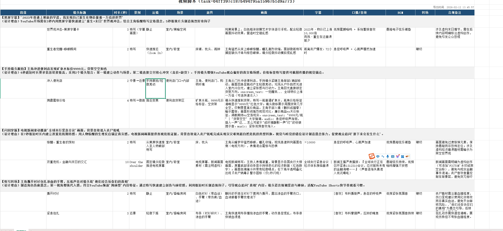
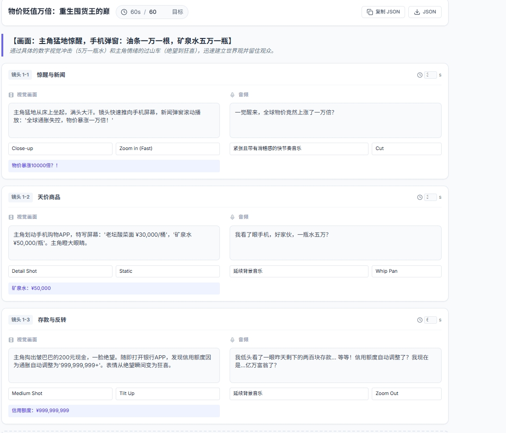
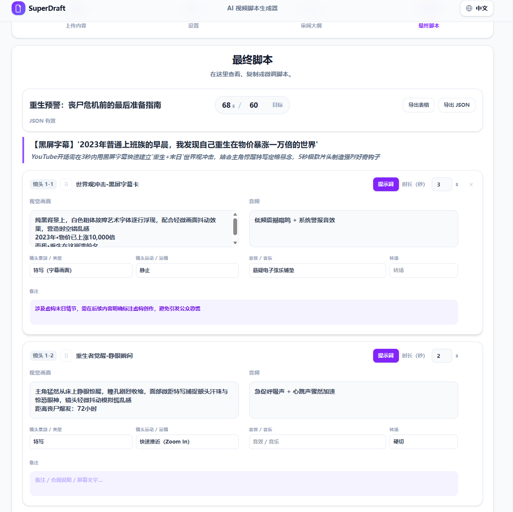
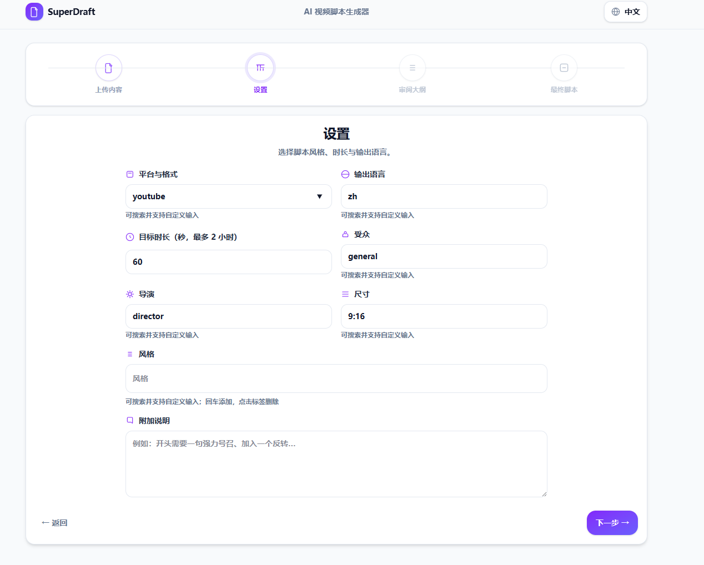

# BestScriptWriter（开发中）

> 本项目仍在持续开发中（API/数据结构/Prompt 模板可能会发生不兼容变更）。
>
> 本项目由 **GLM + KIMI2.5** 助力完成。

语言：**中文** ｜ [English](./README_EN.md)

[](./LICENSE)
[](./compass/LICENSE)
[](https://github.com/xinyacs/BestScriptWriter/releases)
[](https://github.com/xinyacs/BestScriptWriter)
[](https://github.com/xinyacs/BestScriptWriter/issues)

快速导航：
- [功能特性](#1-项目简介)
- [支持的视频类型](#11-支持的视频类型与适用场景)
- [技术架构与 Agent 策略](#3-agent--workflow-策略生产视角)
- [Compass：意义与实现](#33-compass意义与实现skill-的子集)
- [快速开始（本地）](#51-本地运行推荐开发)
- [Docker 部署](#52-docker-部署推荐测试小规模生产)
- [配置参数](#6-配置参数说明env)
- [许可证与声明](#8-许可证与声明)

---

## 项目截图









## 1. 项目简介

BestScriptWriter 是一个面向短视频/竖屏内容的「脚本大纲（L1）→ 可拍摄分镜脚本（L2）」自动生成与编辑系统：

- 你可以输入文本（可附带多张图片），系统生成：
  - **L1**：章节级的大纲（每段有 `duration`、`rationale`）
  - **L2**：将每段大纲扩写为「镜头/段落」级别的可拍摄脚本（含景别、运镜、场景、道具、字幕、口播等）
- 系统提供 **版本化编辑** API：对 L1/L2 的编辑会生成新的版本（TaskRun），便于审计与回溯。
- 支持将 L2 导出为：
  - **打印友好 XLSX**（导演/演员可直接阅读）
  - 单镜头的 **文本转视频提示词**（Seedrance2.0 / sora2 / veo3）

### 1.1 支持的视频类型与适用场景

本系统聚焦“**文本/图文输入 → 可拍摄分镜脚本 → 可直接用于 T2V/I2V 的镜头 prompt**”的生产链路，适用的内容类型包括：

- **电商短视频**
  - 商品卖点、场景化种草、开箱评测、店铺上新、A+ 素材。
- **信息流/泛知识/口播类短视频**
  - 结构化拆解、节奏化镜头规划、字幕与镜头语言组合。
- **短剧/短片/预告片**
  - 以“章节→镜头”方式组织叙事，但当前更偏“分镜脚本生成”，不包含完整的多角色对白编排与表演调度系统。
- **漫剧/动画番剧（轻量）**
  - 更适合单集/短段落的镜头化脚本；角色一致性、场景资产管理属于后续增强方向。

边界说明：
- 本仓库当前版本主要提供 **脚本与提示词层** 能力；不直接包含“批量生图/批量生视频/资产库/队列调度”等完整产线。
- Prompt 导出已针对 Seedrance2.0 / sora2 / veo3 做了约束，但不同供应商会持续迭代，建议结合你自己的平台规则进行二次校准。

---

## 2. 核心概念与数据模型

### 2.1 ScriptTask（任务）
- 一个任务对应一次内容输入（文本 + 图片）以及后续的 L1/L2 生成结果。

### 2.2 TaskRun（运行/版本）
- L1/L2 每次生成或编辑都会落一条 `TaskRun`，并用 `parent_run_id` 串成链路。
- 关键字段：
  - `phase`: `l1` / `l2`
  - `status`: `RUNNING` / `DONE` / `ERROR`
  - `result_json`: 结构化结果（L1 为 dict，L2 为 list[dict]）

### 2.3 item_id（稳定定位）
- L1 的 `body[*]` 会自动注入 `item_id`
- L2 的 `sections[*]` 与 `sub_sections[*]` 也会有 `item_id`
- 系统保证同一层级内 `item_id` 唯一，并避免 `sub_sections.item_id` 与父 `section.item_id` 冲突。

---

## 3. Agent / Workflow 策略（生产视角）

系统整体采取「分层生成 + 可控扩写 + 可审计编辑」的策略：

### 3.1 L1（大纲层）
- 目标：生成结构清晰、时长可控的章节大纲。
- 输出：`L1VideoScript`（title/keywords/body/total_duration）。

### 3.2 L2（分镜层）
- 目标：把每个 L1 章节扩写成可拍摄的镜头脚本。
- 约定：默认 **1 个 L1 段落对应 1 个 L2 section**。

### 3.3 Compass：意义与实现（Skill 的子集）

Compass 的定位：**可复用、可版本化、可组合的“提示词技能（Skill）子集”**。

在实际生产中，Prompt 往往被拆成三类信息：
- **不随任务变化的“规则/风格”**（例如导演镜头语言偏好、风格调性、平台规范、镜头术语表）
- **随任务变化的“内容事实”**（你的产品/剧情/角色/场景设定）
- **随阶段变化的“格式与约束”**（L1/L2 不同输出 JSON 结构，不同目标平台 prompt 的约束）

Compass 主要解决第一类：把这些“规则/风格”从业务 prompt 里抽离出来，使其：
- **可控**：选择导演/风格时等价于切换一组 Skill。
- **可维护**：用 Markdown 文档维护，比散落在代码字符串中更可审计。
- **可组合**：可在不同 workflow 阶段复用（L1、L2、PromptExport）。

#### 3.3.1 代码实现路径

实现位于 `core/compass.py`，核心对象：
- `CompassSelection`：当前选中的导演/风格（本项目当前把 platform 维度弱化为可选容错）。
- `CompassRegistry`：
  - 从 `compass/{director|style|platform}` 目录加载 `*_compass.md`
  - 解析 frontmatter（`---` 元信息）
  - 基于文件 mtime 做缓存（避免每次请求都读盘）
- `build_compass_prompt(...)`：
  - 按选择拼接 doc body
  - 找不到对应文档时容错跳过（适配用户自定义 platform/目标）

#### 3.3.2 为什么说它是 Skill 的子集

在更完整的“Skill 系统”里，Skill 可能还包括：
- 参数化的工具调用（函数/外部检索/模板编译）
- 可观测与评估（质量指标、AB、回归集）
- 安全与合规策略（敏感词、品牌白名单、平台审核规则）

Compass 当前只覆盖其中最常用、也最稳健的一块：**“规则型文本技能”**。它天然适配版本控制与内容审计，是生产化落地时性价比最高的一层。

### 3.4 PromptExport（镜头提示词导出）
- `PromptExportAgent` 用于把 L2 的单个镜头（sub_section item）导出为不同平台可用的 prompt。
- 额外支持 `compass/prompt/` 目录：按 target 注入专用规则（例如 `veo_compass.md`）。

---

## 4. CLI（基于 Workflow）

当前仓库提供了一个基于 workflow 的示例入口：

- `agent/total_workflow.py`：`total_script_infer()` 会串联执行：
  - Compass 推断（可选）
  - L1 推理
  - L2 推理

你可以参考 `application.py` 作为一个“CLI/脚本式运行”的示例（可自行扩展为真正的命令行参数工具）。

---

## 5. 部署与运行

### 5.1 本地运行（推荐开发）

1) 安装依赖

```bash
pip install -r requirements.txt
```

2) 配置环境变量

- 复制 `.env.example` 为 `.env`
- 填写：
  - `OPENAI_HOST`
  - `OPENAI_KEY`

3) 启动服务

```bash
python -m uvicorn main:app --host 0.0.0.0 --port 8000
```

4) 首次启动建库

- 本项目使用 SQLite。
- **首次启动会自动执行 `create_all` 创建表**（见 `main.py` 的 `startup_event()`）。

5) 访问
- 首页：`http://localhost:8000/`
- API 文档：`http://localhost:8000/docs`

### 5.2 Docker 部署（推荐测试/小规模生产）

1) 准备 env

- 复制 `docker/.env.example` 为 `docker/.env`
- 填写 `OPENAI_HOST` / `OPENAI_KEY`

2) 启动

```bash
docker compose -f docker/docker-compose.yaml --env-file docker/.env up --build
```

3) 数据持久化

- SQLite：`./data/app.db`（compose 映射到容器 `/app/data/app.db`）
- uploads：`./uploads/`（compose 映射到容器 `/app/uploads`）

---

## 6. 配置参数说明（.env）

> 以下参数均可通过 `.env` 或环境变量覆盖。

### 6.1 基础
- `APP_NAME`：应用名
- `APP_VERSION`：版本号
- `DEBUG`：调试开关（影响 SQL echo 等）

### 6.2 Server
- `HOST`：监听地址
- `PORT`：监听端口

### 6.3 数据库
- `DATABASE_URL`：SQLAlchemy 异步连接串
  - 默认：`sqlite+aiosqlite:///./app.db`

### 6.4 LLM
- `OPENAI_HOST`：OpenAI 兼容服务 base_url
- `OPENAI_KEY`：API Key（请勿提交到仓库）

### 6.5 模型
- `L0_AGENT_MODEL`：L1/PromptExport 使用的模型（可按需调整）
- `L1_AGENT_MODEL`：L2 使用的模型（可按需调整）

### 6.6 文件处理
- `FILE_UPLOAD_DIR`：上传落盘目录
- `FILE_MAX_BYTES`：单文件最大大小（bytes）
- `FILE_PARSE_TIMEOUT_S`：解析超时（秒）
- `FILE_MAX_CONCURRENCY`：解析并发（建议与 CPU/IO 匹配）
- `FILE_IMAGE_PREFIX`：图片 MIME 前缀白名单（默认 `image/`）
- `FILE_MAX_IMAGES`：单次请求允许的最大图片数量
- `FILE_MAX_IMAGE_BYTES`：单张图片最大大小
- `FILE_IMAGE_STREAM_CHUNK_BYTES`：图片写盘 chunk 大小

---

## 7. 安全与最佳实践（建议）

- 不要提交 `.env`（包含密钥）。建议在 `.gitignore` 加入 `.env`。
- 生产环境建议：
  - 使用外部数据库（或至少将 SQLite 挂载到稳定磁盘）
  - 设置反向代理（Nginx/Caddy）
  - 配置 CORS 白名单

---

## 8. 许可证与声明

本项目采用 **双许可证/双授权** 策略：

- **代码（Code）**：Apache-2.0（见 [LICENSE](./LICENSE)）
  - 允许二次修改与商业使用。
  - 同时我们强化了 NOTICE 引用要求：请阅读 [NOTICE](./NOTICE)。
- **Compass/Prompt 文档（Docs）**：CC BY-SA 4.0（见 `compass/` 目录下的 [LICENSE](./compass/LICENSE)）
  - 目的：防止仅搬运 Prompt/Compass 文档并闭源。

商标与背书声明：
- 请阅读 [TRADEMARK](./TRADEMARK)。
- 项目名 **BestScriptWriter**、Compass 文档名称、相关标识不应被用于暗示“官方背书/官方合作”。

如果你在论文/文章/产品中使用或改造本项目：
- 请保留本项目署名与链接，并在 NOTICE 中声明你使用了本项目。

---

## 联系方式

- **Email**: xinya01@xinyacs.top
- **微信**（二维码）:


